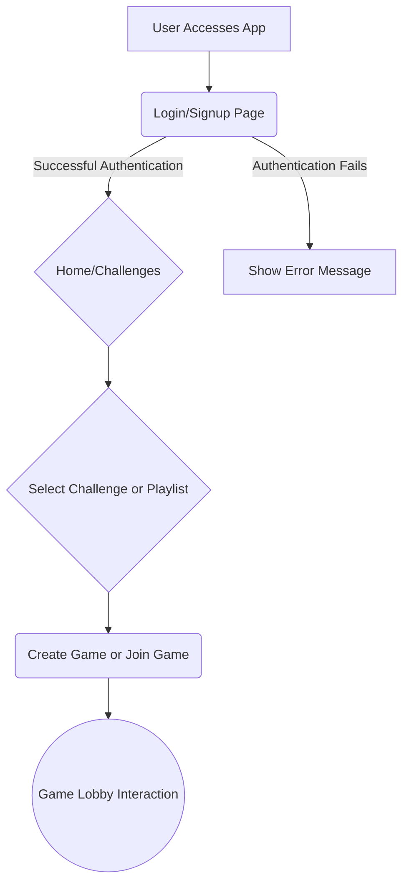

# 🎮 Challenge Game Manager

A dynamic web application to create, manage, and engage in challenge-based games. Features user authentication, dynamic challenge selection, custom playlist creation, and real-time game lobby interactions. Built using JavaScript and designed for seamless integration with a backend API.

---

## ✨ Key Features

- **Secure User Authentication:** Robust login and signup system using JWT-based session management for enhanced security.
- **Dynamic Challenge Management:** Explore, filter, and sort challenges in real-time to find the perfect game.
- **Custom Game Creation:** Tailor games with personalized playlists and configurable settings, including player limits and rounds.
- **Real-Time Lobby Interaction:** Engage with other players through real-time chat and dynamic lobby updates for an immersive experience.

---

## 🚀 Application Workflow

The application follows a streamlined workflow to ensure an intuitive user experience:

1.  **Accessing the App**: Users start by accessing the application, which directs them to the login or signup page.
2.  **Authentication**: Users can either log in with existing credentials or sign up for a new account.
3.  **Home/Challenges**: Upon successful authentication, users are redirected to the home page or directly to the challenges section.
4.  **Challenge/Playlist Selection**: Users can select a challenge from a list or create their own game using a custom playlist.
5.  **Game Interaction**: Join existing games or create new ones and engage with other players in the game lobby.



---

## 🛠 Installation

To get the project up and running, follow these steps:

1.  **Clone the Repository:**
    ```bash
    git clone https://github.com/your-repo/challenge-game-manager.git
    cd challenge-game-manager
    ```
2.  **Install Dependencies:**
    ```bash
    npm install
    ```
3.  **Start the Development Server:**
    ```bash
    npm start
    ```
4.  **Open the Application:**
    Open your web browser and navigate to `http://localhost:3000` to access the application.

---

## 📖 Usage

### Authentication
1.  Navigate to the login page (`login.html`) to authenticate or the signup page (`signup.html`) to create an account.
2.  Enter your credentials. For signup, ensure your password meets these criteria:

    *   8–16 characters long.
    *   Includes at least one uppercase letter, one lowercase letter, one number, and one special character.
3.  Upon successful login/signup, you will be redirected to the home page.

### Challenge Selection

1.  Navigate to the challenges page (`pick-challenge.html`).
2.  Use the available filters, sorting options, or the search bar to find challenges that match your preferences.
3.  Click "Enter Lobby" to join a public or private challenge. For private games, you may need to enter a game code.

### Game Creation

1.  Navigate to the playlist selection page (`pick-playlist.html`).
2.  Select a playlist and configure the game settings, such as the number of players and rounds.
3.  Submit your configuration to create a new game.

### Lobby Interaction

1.  After joining or creating a game, you will be redirected to the game lobby (`lobby.html`).
2.  Use the chat features and other interactive elements to communicate and engage with other players in real time.

---

## 🗂️ File Structure

The project's file structure is organized as follows:

```plaintext
├── login.js          # Handles user login functionality
├── signup.js         # Handles user registration functionality
├── pick-challenge.js # Manages challenge display and interaction
├── pick-playlist.js  # Manages playlist selection and game creation
├── game.js           # Handles real-time lobby interactions
```

---

## 🧩 Key Components

### `login.js`

-   **Functionality**: Handles user login.
-   **Process**: Sends user credentials via a POST request to the backend.
-   **Outcome**: Stores the JWT token in `localStorage` upon successful authentication and redirects the user to `home.html`.

### `signup.js`

-   **Functionality**: Manages user registration.
-   **Process**: Validates input fields, including password strength, and sends user data via a POST request to the backend.
-   **Outcome**: Redirects the user to `login.html` upon successful signup.

### `pick-challenge.js`

-   **Functionality**: Dynamically displays challenges.
-   **Process**: Fetches challenge data from the backend using JWT tokens, providing filtering, sorting, and search capabilities.
-   **Outcome**: Allows users to join public or private games.

### `pick-playlist.js`

-   **Functionality**: Handles playlist-based game creation.
-   **Process**: Reads URL parameters for game configuration and sends POST requests to create games.
-   **Outcome**: Redirects users to the lobby after successful creation.

### `game.js`

-   **Functionality**: Manages real-time interactions in the game lobby.
-   **Process**: Handles chat input and updates dynamically, updating the lobby state based on backend responses.
-   **Outcome**: Facilitates real-time engagement among players.

---

## ⚙️ Example API Calls

Here are example API calls demonstrating key functionalities:

### Login Request

```javascript
fetch(`${config.address}/login`, {
    method: 'POST',
    headers: { 'Content-Type': 'application/json' },
    body: JSON.stringify({ username: 'user', password: 'pass' })
});
```

### Fetch Challenges

```javascript
fetch(`${config.address}/challenges`, {
    method: 'GET',
    headers: { 'Authorization': `Bearer ${token}` }
});
```

### Create Game

```javascript
fetch(`${config.address}/game/create`, {
    method: 'POST',
    headers: {
        'Content-Type': 'application/json',
        'Authorization': `Bearer ${token}`
    },
    body: JSON.stringify({
        maxPlayers: 4,
        rounds: 5,
        playlist: 'Rock Classics'
    })
});
```

---

## 🤝 Contributing

We encourage contributions to enhance the project. To contribute:

1.  Fork the repository.
2.  Create a new branch for your feature or bug fix:

    ```bash
    git checkout -b feature-name
    ```
3.  Commit your changes:

    ```bash
    git commit -m "Add new feature"
    ```
4.  Push your branch:

    ```bash
    git push origin feature-name
    ```
5.  Open a pull request on GitHub.

---

## 📜 License

This project is licensed under the MIT License. See the [LICENSE](LICENSE) file for details.

---

## 🔮 Future Improvements

We plan to implement the following improvements:

1.  **Unit Tests**: Add comprehensive unit tests for frontend modules.
2.  **Error Handling**: Improve error handling for edge cases, such as network failures.
3.  **Enhanced UI/UX**: Enhance the user interface and user experience for better engagement.

